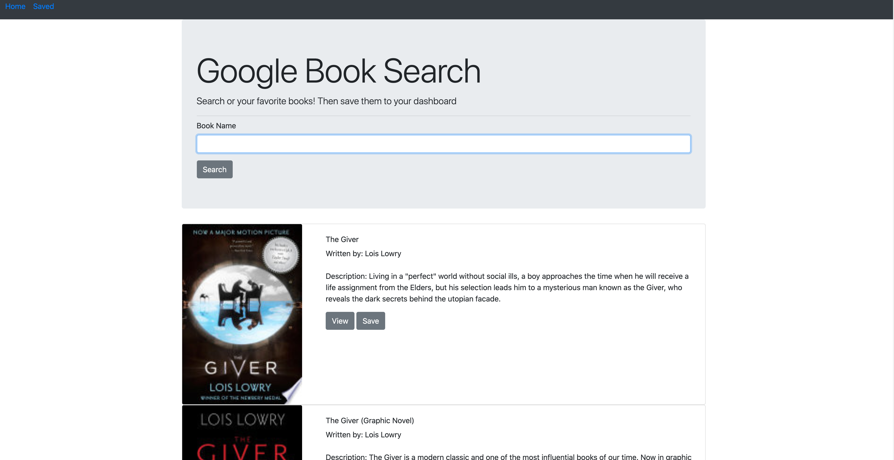
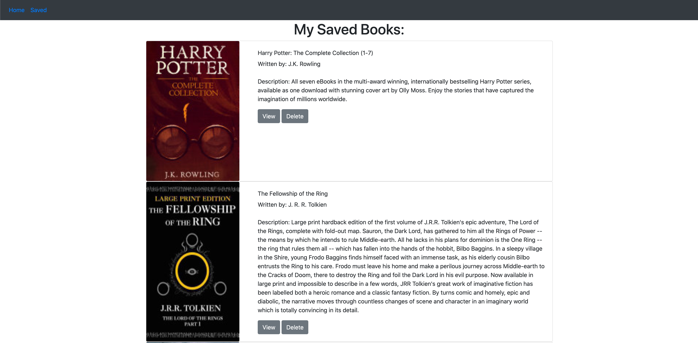

# google-books-search

App deployed at: https://warm-peak-53739.herokuapp.com/saved

### Description:
>This is a full stack MERN web application that allows a user to search for any book by its name.  Then a list of books will populate as search results, and the user can see the book title, cover, description, authors, and the link to the the book info.  The user can then save that book into their dashboard

## Technologies Used:
This is MERN application.  Utilizing MongoDB for my database , Express to handle our server, React to handle the front end, and Node.js to connect the backend.  We also utilize a 3rd party api for google books to get the books from their database.  We are also using reactstrap, and react-router-dom.   

## Usage:
Upon landing on the home page, you will be allowed to search for any book my typing in the name.  Click search, and then the list of books will populate.  You can click view to see more information on the book.  To **save** the book click the save button.  To see your dashboard of the books you've saved, click the saved button in the navbar.  The list of saved books will populate will all the same information.  To delete the book, simply click the delete button.

